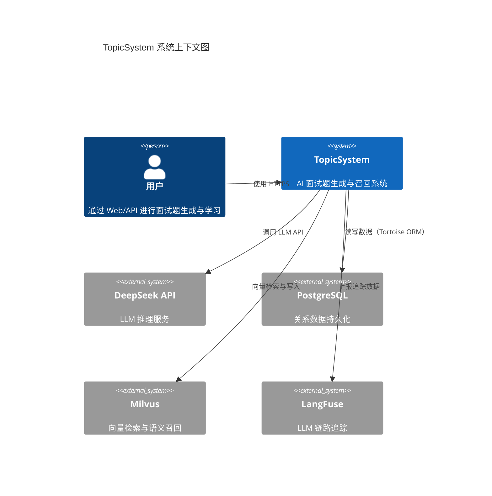
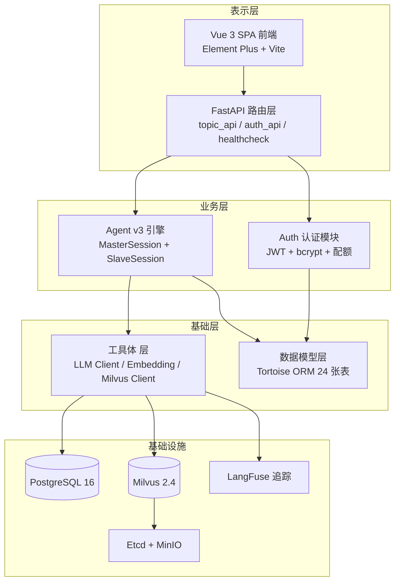

# 架构设计

> **生成时间**：2026-06-12 00:06:53  
> **基于提交**：168f526（main）  
> **覆盖模块**：全部

---

## 架构风格

**Agent 自主编排 + Master/Slave 隔离**。系统采用 LangGraph ReAct Agent 模式，LLM 通过 model-native tool calling 自主决策调用链路，无硬编码路由。Master 持有读能力（读者），Slave 持有写能力（写者），写入有独立事务边界。

## 系统上下文图

## 分层设计

| 层级 | 职责 | 关键组件 |
|------|------|----------|
| 表示层 | 前端 UI + API 路由 | Vue 3 SPA、FastAPI Router、全局鉴权中间件 |
| 业务层 | Agent 编排 + 认证 | MasterSession（或编排者）、SlaveSession（写隔离）、JWT 双 Token |
| 基础层 | LLM/Embedding/Milvus 调用 | LLMClient（单例）、EmbeddingEncoder（单例）、MilvusClient（单例） |
| 基础设施 | 数据持久化 + 追踪 | PostgreSQL 16、Milvus 2.4、Etcd、MinIO、LangFuse |

## 设计模式

| 模式 | 应用场景 | 示例代码位置 |
|------|----------|-------------|
| **单例模式** | LLMClient、EmbeddingEncoder、MilvusClient 全局复用 | `src/tools/llm_client.py:LLMClient.get_instance()` |
| **注册表模式** | CapabilityRegistry（能力注册 + freeze 冻结） | `src/agentv3/registry.py:CapabilityRegistry` |
| **策略/模板方法** | PromptBuilder 动态注入工具列表 | `src/agentv3/prompt_builder.py:PromptBuilder.build()` |
| **装饰器/代理** | ToolExecutor 包裹能力调用（超时/预算/熔断/日志） | `src/agentv3/executor.py:ToolExecutor` |
| **熔断器** | CircuitBreaker 防 LLM API 级联故障 | `src/agentv3/circuit_breaker.py:CircuitBreaker` |
| **事务发件箱** | Outbox Pattern 保证 PG + Milvus 最终一致 | `src/models/outbox.py` + `src/agentv3/capabilities/write.py` |
| **沙盒隔离** | SlaveSession 隔离写入操作 | `src/agentv3/slave.py:SlaveSession` |
| **能力安全模型** | Permission 枚举 + SlaveCapabilityRegistry 白名单 | `src/agentv3/permissions.py` + `src/agentv3/slave_registry.py` |

## 架构决策记录（ADR）

| 决策 | 背景 | 结论 |
|------|------|------|
| **采用 ReAct Agent 替代线性流水线** | v1 的线性流水线（API → Service → LLM → DB）无法根据召回结果动态调整路径 | 使用 LangGraph ReAct Agent，LLM 自主决策 tool calling，HIT/MISS 自动分流 |
| **Master/Slave 隔离写入** | 防止 Agent 幻觉导致的数据污染 | Master 仅持有读能力，Slave 仅持有 Master 显式授予的写能力，写入有事务边界 |
| **5 层防呆召回 + 双分数校验** | 向量相似度 ≠ 语义相关性（如"线程池"与"连接池"cosine 高达 0.85+） | Layer 0-5 逐层过滤 + Score A（余弦）+ Score B（LLM 语义）双判 |
| **Outbox 补偿而非分布式事务** | Milvus 写入可能失败但不应阻塞主流程 | PG 事务写入 Outbox 记录，后台 Worker 异步重试 Milvus 插入 |
| **Capability 自举** | 新增能力不应需要修改编排代码 | 每个 Capability 携带 args_schema + to_langchain_tool()，一行 register() 即可 |
| **Token 版本号机制** | 简单 JWT 无强制下线能力 | 用户每次改密/登录时 token_version++，旧 Token 自动失效 |

## 技术债务与改进建议

- `LLM_SECRET_KEY` 硬编码在 `auth/jwt.py` 中，建议移至环境变量
- `worker/` 和 `tracing/` 目录仅有 `__init__.py`（空文件），Outbox 补偿消费者未实现
- Agent v2（`src/agent/`）为兼容保留旧代码，与 v3 存在部分功能重叠，建议评估后可移除
- 前端 `User/List.vue`、`User/Level.vue` 仅具有基本框架（~200 行），功能不完整
- `test_agentv3.py` 中 Golden Dataset 测试依赖外部 DeepSeek API，CI 中已跳过（非确定性测试）
