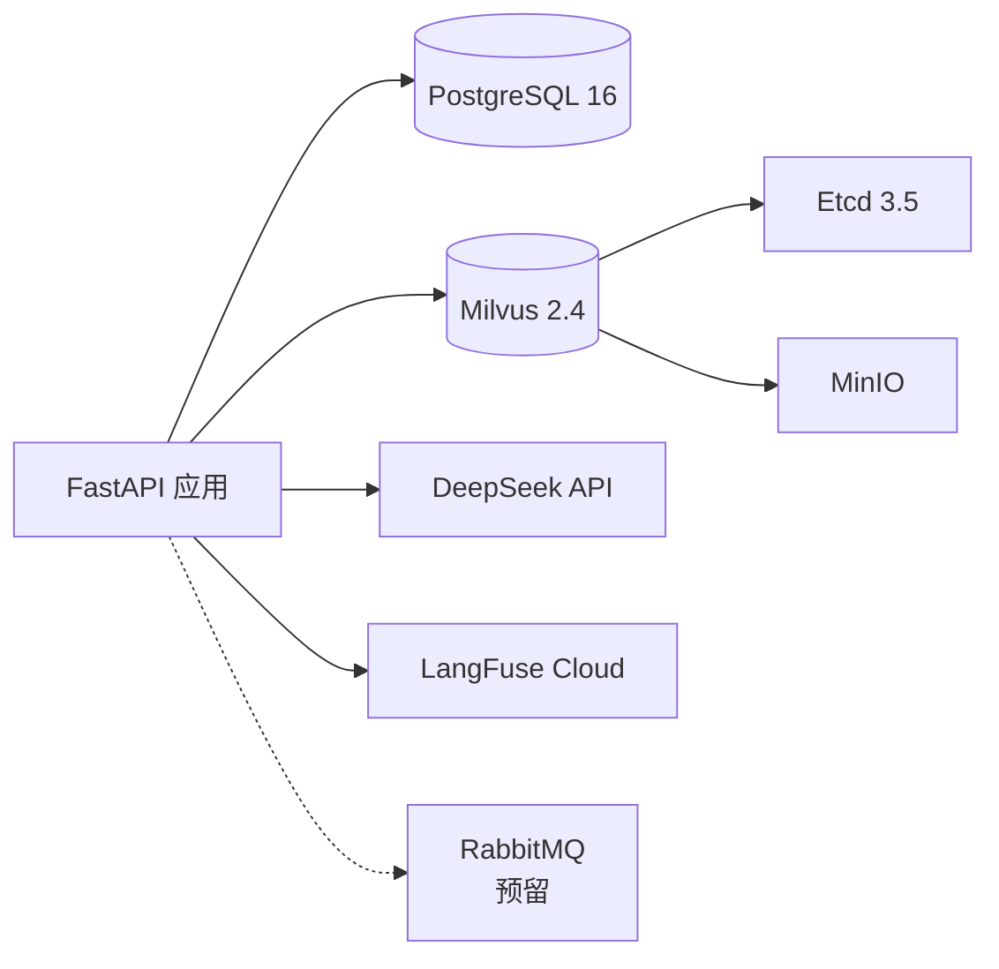

# 技术栈

> **生成时间**：2026-06-12 00:06:53  
> **基于提交**：168f526（main）  
> **覆盖模块**：全部

---

## 运行时

| 项 | 版本 | 用途 |
|----|------|------|
| Python | ^3.12 | 后端运行时 |
| Node.js | — | 前端构建运行时（Vite 8.x） |

## 核心框架

| 框架 | 版本 | 用途 |
|------|------|------|
| FastAPI | >=0.115.0 | 异步 Web 框架，API 路由 |
| Uvicorn | >=0.43.0 | ASGI 服务器 |
| Pydantic | >=2.0 | 数据校验与序列化 |
| Pydantic-Settings | >=2.13.0 | 环境变量配置管理 |
| LangGraph | >=0.2.0 | ReAct Agent 编排框架 |
| LangChain | >=0.3.0 | LLM 抽象层 |
| LangChain-OpenAI | >=0.3.0 | OpenAI 兼容协议适配 |
| Vue 3 | ^3.5.32 | 前端渐进式框架 |
| Element Plus | ^2.13.7 | Vue 3 UI 组件库 |
| Vue Router | ^4.6.4 | 前端路由 |
| Vite | ^8.0.4 | 前端构建工具 |

## 数据库与存储

| 组件 | 版本 | 用途 |
|------|------|------|
| PostgreSQL | 16 | 关系数据库（含 pgvector 扩展） |
| Tortoise ORM | >=0.24.0 | 异步 ORM |
| Aerich | >=0.7.0 | 数据库迁移管理 |
| asyncpg | latest | 异步 PostgreSQL 驱动 |
| Milvus | 2.4 standalone | 向量数据库（HNSW 索引） |
| pymilvus | >=2.4.0 | Milvus Python SDK |

## AI / LLM

| 组件 | 版本 | 用途 |
|------|------|------|
| DeepSeek Chat | latest | 默认 LLM 模型 |
| sentence-transformers | >=3.0.0 | Embedding 模型加载 |
| bge-large-zh-v1.5 | latest | 中文文本向量化（1024 维） |

## 中间件

| 组件 | 版本 | 用途 |
|------|------|------|
| aio-pika | >=9.4.0 | 异步 RabbitMQ 客户端 |
| python-jose | latest | JWT 令牌生成/验证 |
| passlib[bcrypt] | latest | 密码哈希 |
| python-multipart | latest | 文件上传解析 |

## 可观测性

| 组件 | 版本 | 用途 |
|------|------|------|
| OpenTelemetry API | >=1.20 | 分布式追踪 API |
| OpenTelemetry SDK | >=1.20 | 追踪数据采集 |
| OpenTelemetry Exporter OTLP | >=1.20 | OTLP 协议导出 |
| LangFuse | >=2.0.0 | LLM 调用链路追踪 |

## 开发工具

| 工具 | 版本 | 用途 |
|------|------|------|
| Poetry | latest | Python 依赖管理与虚拟环境 |
| Ruff | >=0.5 | Python 代码检查与格式化 |
| Docker Desktop | latest | 容器化开发环境 |
| Git | — | 版本控制 |

## 测试工具

| 工具 | 版本 | 用途 |
|------|------|------|
| pytest | >=8.0 | 测试框架 |
| pytest-asyncio | >=0.24 | 异步测试支持 |
| httpx | >=0.27 | 异步 HTTP 测试客户端 |

## 依赖关系图（中间件视角）

