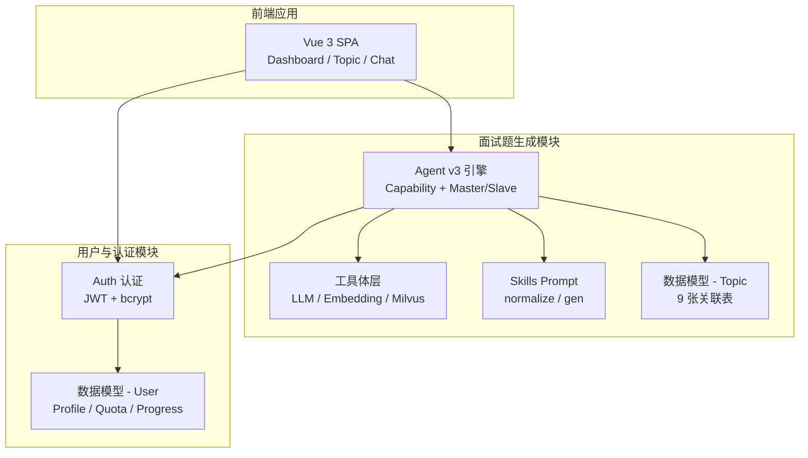

# 核心模块

> **生成时间**：2026-06-12 00:06:53  
> **基于提交**：168f526（main）  
> **覆盖模块**：面试题生成模块、用户与认证模块、前端应用

---

## 模块总览

## 模块清单

### 面试题生成模块

- **职责**：核心业务——接收用户输入，通过 Agent 编排 8 个原子能力完成面试题的召回/生成/校验/写入全流程
- **入口文件**：`src/main.py`（FastAPI 应用入口 + 能力注册）→ `src/api/topic_api_v3.py`（Agent 生成端点）
- **关键类/函数**：
  - `MasterSession` — Agent 编排器，构建工具/提示/LLM，解析执行结果
  - `SlaveSession` — 写隔离执行器，仅执行 Master 授予的写能力
  - `ToolExecutor` — 运行时保护（超时/预算/熔断/日志）
  - `CapabilityRegistry` — 能力注册表（freeze 冻结机制）
  - `CircuitBreaker` — 熔断器（CLOSED → OPEN → HALF_OPEN）
  - `TokenBudget` — Token 预算计数器
  - `LLMClient` — DeepSeek 统一客户端（单例）
  - `EmbeddingEncoder` — bge-large-zh 编码器（单例）
  - `MilvusClient` — Milvus CRUD + 混合检索（单例）
- **依赖的模块**：用户与认证模块（鉴权）
- **被依赖的模块**：无（业务核心）
- **设计模式**：单例模式（工具层）、注册表模式（能力注册）、装饰器模式（ToolExecutor）、熔断器模式、事务发件箱模式、沙盒隔离模式

### 用户与认证模块

- **职责**：用户注册/登录/Token 管理、配额管理、用户学习进度追踪
- **入口文件**：`src/auth/api.py`（认证路由）、`src/auth/jwt.py`（JWT）
- **关键类/函数**：
  - `create_access_token()` / `create_refresh_token()` — JWT 双 Token 创建
  - `global_auth_middleware()` — 全局 ASGI 鉴权中间件（re`quest.state.user_id`注入）
  - `get_current_user()` — FastAPI 依赖注入鉴权
  - `hash_password()` / `verify_password()` — bcrypt 密码哈希
- **依赖的模块**：无（独立模块）
- **被依赖的模块**：面试题生成模块（通过中间件鉴权）
- **设计模式**：中间件模式（全局鉴权）、依赖注入（FastAPI Depends）、Token 版本号强制下线

### 前端应用

- **职责**：Vue 3 SPA 用户界面——题库浏览、题目详情、Agent 对话生成、Dashboard 学习统计
- **入口文件**：`TOPICSYSTEM_Web/src/main.js`
- **关键类/函数**：
  - `MainLayout.vue` — 全局布局（导航 + 用户状态）
  - `Topic/List.vue` — 题库列表（搜索/标签过滤/三列布局）
  - `Topic/Detail.vue` — 题目详情（含配额锁定截断）
  - `Chat/index.vue` — Agent 对话界面（流式支持）
  - `Dashboard/index.vue` — 学习 Dashboard（统计 + 偏好设置）
- **依赖的模块**：面试题生成模块（API 调用）、用户与认证模块（登录/注册）
- **被依赖的模块**：无
- **设计模式**：SPA 路由模式、组件化 UI、Axios 拦截器（Token 注入 + 401 刷新）

## 模块间通信

| 调用方 | 被调用方 | 方式 | 说明 |
|--------|----------|------|------|
| 前端应用 | 面试题生成模块 | HTTP REST（Axios） | `POST /api/v3/topic/generate`、`GET /api/v1/topic/*` |
| 前端应用 | 用户模块 | HTTP REST（Axios） | `POST /api/auth/login` 等 |
| 面试题生成模块 | 用户模块 | ASGI 中间件 | `global_auth_middleware` 注入 `request.state.user_id` |
| MasterSession | SlaveSession | 函数调用 | `slave.execute(state_copy)` |
| ToolExecutor | LLMClient | 异步调用 | `LLMClient.ainvoke()` |
| CapabilityRegistry | SlaveCapabilityRegistry | 独立白名单 | Slave 仅能使用明确注册的写能力 |
