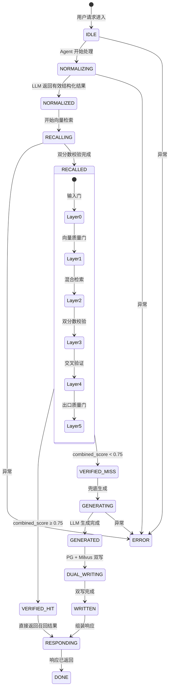

# 数据流

> **生成时间**：2026-06-12 00:06:53  
> **基于提交**：168f526（main）  
> **覆盖模块**：面试题生成模块

---

## 核心数据流图：Agent Loop 请求处理

```mermaid
graph LR
  A[用户输入] --> B[FastAPI Endpoint<br/>POST /api/v3/topic/generate]
  B --> C[ASGI 鉴权中间件<br/>JWT + 配额检查]
  C --> D[MasterSession<br/>创建 Agent]
  D --> E[CapabilityRegistry<br/>过滤 read 能力]
  E --> F[ToolExecutor<br/>运行时保护]
  F --> G{Agent 决策}
  G -->|normalize| H[LLM 语义归一化<br/>用户输入 → 结构化查询]
  H --> I[search_knowledge<br/>Milvus 混合检索]
  I --> J[verify_match<br/>双分数校验]
  J -->|HIT| K[respond<br/>返回召回结果]
  J -->|MISS| L[generate_topic<br/>LLM 兜底生成]
  L --> M[validate_output<br/>质量校验]
  M --> N[SlaveSession<br/>写入隔离]
  N --> O[save_to_postgres<br/>PG 事务写入]
  O --> P[save_to_milvus<br/>Milvus 向量写入]
  P --> Q[AgentTrace<br/>落库追踪]
```



## Agent 状态机



## 双分数校验（Layer 3）详细流

```
┌─ 候选题目 ─┐
              │
       ┌──────▼──────┐
       │ Score A      │  向量余弦相似度 (cosine)
       │ < 0.75?     │── 是 ──► 淘汰（不调 LLM）
       │ ≥ 0.75       │
       └──────┬──────┘
              │
       ┌──────▼──────┐
       │ Score B      │  LLM 语义匹配 (NL_MATCH_PROMPT)
       │ < 0.70?     │── 是 ──► 淘汰
       │ ≥ 0.70       │
       └──────┬──────┘
              │
       ┌──────▼──────┐
       │ combined     │  0.5 × A + 0.5 × B
       │ ≥ 0.75?     │── 是 ──► PASS
       │              │
       └──────────────┘
```

## 状态管理

| 状态类型 | 存储位置 | 生命周期 | 管理方式 |
|----------|----------|----------|----------|
| Agent 请求状态 | `AgentSession` 实例 | 单次请求 | `session.py`：迭代/时间/Token 三维预算 + `guard()` |
| 用户 Token | `Authorization Bearer` + `request.state` | Access 7 天 / Refresh 7 天 | `global_auth_middleware` 注入 |
| 用户配额 | `UserQuota` 模型（PG） | 持久化 | 每次请求扣减 `agent_credits`/`topic_credits` |
| 用户缓存 | `TTLCache` 内存 | 60 秒 | `src/api/cache.py`：用户信息缓存 |
| Agent 追踪 | `AgentTrace` + `PromptCallLog`（PG） | 持久化 | MasterSession 执行前后落库 |

## 数据持久化路径

**写入路径（生成 → 双写）**：
```
1. 开启 PG 事务
2. 写入 Topic 主表（src/models/topic.py）
3. 写入 8 张关联表（Prerequisite, CoreConcept, Derivative, Extension,
   EvaluationAnchor, SimilarQuestion, AdvancedQuestion, Reference）
4. 提交 PG 事务
5. 编码 core_concept → Embedding（bge-large-zh）
6. 插入 Milvus topic_embeddings Collection
7. 成功 → 标记 Outbox 为 PROCESSED
8. 失败 → Outbox 保持 PENDING（后台 Worker 异步重试）
```

## 数据一致性保证

| 机制 | 应用场景 | 说明 |
|------|----------|------|
| PG 事务 | 写入 Topic + 8 关联表 | `in_transaction()` 原子提交 |
| Outbox Pattern | Milvus 写入补偿 | PG 成功后写 Outbox 记录，Worker 定时重试 |
| Deep Copy 隔离 | SlaveSession | `copy.deepcopy(state)` 防止写操作污染 Master 上下文 |
| 容错分支 | 关联表写入失败 | 单张关联表失败不阻塞其他表，静默捕获 |

## 缓存策略

| 缓存层级 | 存储介质 | TTL | 失效策略 |
|----------|----------|-----|----------|
| 用户信息缓存 | 内存 `TTLCache` | 60 秒 | 自动过期；密码修改/登录时 token_version++ 间接失效 |
| 题库列表缓存 | 内存 `TTLCache` | 30 秒（无过滤条件时） | 自动过期 |
| 标签列表缓存 | 内存 `TTLCache` | 300 秒（5 分钟） | 自动过期 |
