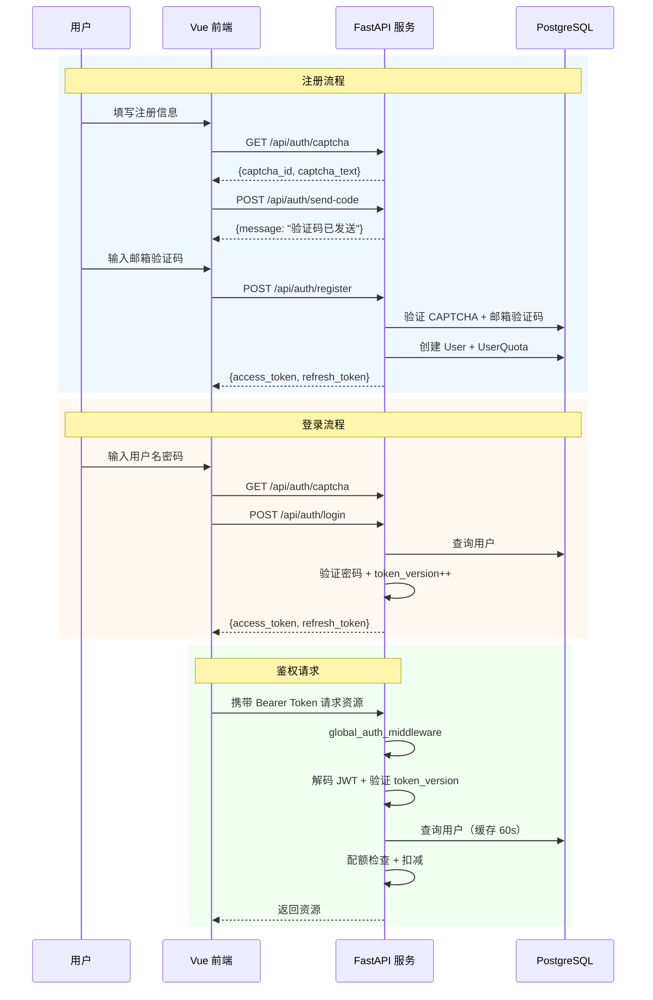

# 认证与授权

> **生成时间**：2026-06-12 00:06:53  
> **基于提交**：168f526（main）  
> **覆盖模块**：用户与认证模块

---

## 认证方式

| 方式 | 实现 | 适用范围 |
|------|------|----------|
| JWT Bearer Token | `src/auth/jwt.py`：HS256 对称加密 | 全部需认证的 API |
| 双 Token 机制 | Access Token + Refresh Token | 用户登录/Token 刷新 |
| 邮箱验证码 | QQ SMTP 发送 6 位数字验证码 | 用户注册 |
| 图形验证码 | 4 位数字 CAPTCHA | 登录/注册防刷 |

## 认证流程



## 授权模型

当前系统采用**基于配额的用户分层模型**：

| 角色 | 权限 |
|------|------|
| 登录用户 | 查看题库（完整内容）、Agent 对话生成、题目状态标记、个人资料管理 |
| 匿名用户 | 查看题库（截断内容）、浏览标签、获取验证码、注册/登录 |
| 配额耗尽用户 | 查看题库（截断内容，locked=true）、Agent 生成返回 403 |

系统支持 `User.is_superuser` 字段和菜单权限管理（`Menu`、`System/Permission` 页面），但当前代码中未发现 RBAC 鉴权逻辑的完整实现——admin 权限由前端页面路由控制，后端无 admin 专属鉴权。

## Token 管理

| 属性 | 值 |
|------|-----|
| Token 类型 | JWT（HS256 对称签名） |
| Access Token 过期 | 10080 分钟（7 天） |
| Refresh Token 过期 | 7 天 |
| 刷新机制 | `POST /api/auth/refresh`，验证 refresh token → 签发新 token pair |
| 存储位置 | 前端 `localStorage`（`token` + `refreshToken`） |

### Token 版本号机制

```
JWT payload: {"sub": user_id, "ver": token_version, "type": "access", "exp": ..., "iat": ...}

用户修改密码 → token_version++
用户重新登录 → token_version++

鉴权时验证：if user.token_version != payload.ver → 401 拒绝
```

每次登录/修改密码时 `token_version` 递增，所有旧 Token 立即失效，实现"强制下线"能力。

## 安全措施

| 措施 | 实现 |
|------|------|
| 密码哈希 | `bcrypt`（`passlib[bcrypt]` 库） |
| 密码规则 | 最少 8 字符，必须包含字母和数字（Pydantic validator） |
| 用户名规则 | 最少 6 字符，必须以字母开头 |
| JWT 密钥 | 硬编码：`"topicsystem-jwt-secret-change-in-production-2026"`（应移至环境变量） |
| HTTPS | [待补充：Docker Compose 使用 HTTP，生产环境需配置 HTTPS] |
| CSRF 防护 | 未实现（JWT Bearer Token 天然免疫 CSRF） |
| 速率限制 | 未实现（依赖图形验证码防刷） |
| CORS | 仅允许 `http://localhost:5173` 和 `http://localhost:3000` |

## 公开路径清单

以下路径绕过鉴权中间件：

```
/, /ping, /docs, /openapi.json, /redoc,
/api/auth/register, /api/auth/login, /api/auth/refresh,
/api/auth/captcha, /api/auth/send-code,
/api/v1/topic/tags, /api/v1/topic/positions,
/api/v1/topic/list, /api/v1/topic/{id},
/api/v1/topic/dashboard/stats,
/terms, /privacy
```
