# 数据库设计

> **生成时间**：2026-06-12 00:06:53  
> **基于提交**：168f526（main）  
> **覆盖模块**：全部

---

## 数据库概览

| 数据库 | 类型 | ORM/驱动 | 用途 |
|--------|------|----------|------|
| PostgreSQL 16 | 关系型（SQL） | Tortoise ORM + asyncpg | 业务数据持久化 |
| Milvus 2.4 | 向量数据库（NoSQL） | pymilvus | 向量检索与语义召回 |

## 数据模型

### Topic（面试题主表）

| 字段 | 类型 | 约束 | 说明 |
|------|------|------|------|
| `id` | UUID | PK | 主键 |
| `topic` | varchar(255) | — | 面试题名称 |
| `alias` | JSON (CompatibleJSONField) | nullable | 别名列表 |
| `domain` | varchar(100) | — | 技术领域 |
| `category` | varchar(100) | nullable | 子分类 |
| `tags` | JSON | nullable | 标签列表 |
| `difficulty` | int | default=1 | 难度 1-5 |
| `mastery_level` | int | default=0 | 掌握程度 |
| `review_count` | int | default=0 | 复习次数 |
| `keywords` | JSON | nullable | 关键词列表 |
| `core_summary` | text | nullable | 核心摘要 |
| `one_liner` | varchar(200) | nullable | 一句话总结（40-80 字符） |
| `core_points` | text | nullable | 核心知识点 |
| `detailed_explanation` | text | nullable | 详细解释（200-500 字符） |
| `code_example` | text | nullable | 代码示例 |
| `traps` | text | nullable | 常见陷阱 |
| `bonuses` | text | nullable | 加分项 |
| `embedding_vector` | text | nullable | 向量 Embedding（用于语义搜索） |
| `last_reviewed` | datetime | nullable | 上次复习时间 |
| `next_review` | datetime | nullable | 下次复习时间 |
| `created_at` | datetime | auto | 创建时间 |
| `updated_at` | datetime | auto | 更新时间 |

### Topic 关联表（9 张，星型结构）

| 模型 | 对应 JSON 字段 | 关键字段 |
|------|----------------|----------|
| `TopicPrerequisite` | prerequisites | `topic` FK, `content`, `sort_order` |
| `TopicCoreConcept` | core_concepts | `topic` FK, `content`, `sort_order` |
| `TopicDerivative` | derivatives | `topic` FK, `content`, `sort_order` |
| `TopicExtension` | extensions | `topic` FK, `content`, `sort_order` |
| `TopicEvaluationAnchor` | evaluation_anchors | `topic` FK, `level`, `content`, `sort_order` |
| `TopicSimilarQuestion` | similar_questions | `topic` FK, `question`, `answer_hint`, `sort_order` |
| `TopicAdvancedQuestion` | advanced_questions | `topic` FK, `question`, `answer_hint`, `sort_order` |
| `TopicReference` | references | `topic` FK, `title`, `url`, `description`, `sort_order` |
| `TopicReviewLog` | — | `topic` FK, `review_date`, `mastery_level`, `review_duration`, `notes` |

所有关联表对 `Topic` 使用 `on_delete=CASCADE`，删除题目时级联删除所有关联数据。

### User（用户表）

| 字段 | 类型 | 约束 | 说明 |
|------|------|------|------|
| `id` | UUID | PK | 主键 |
| `username` | varchar(50) | unique | 用户名 |
| `email` | varchar(100) | unique | 邮箱 |
| `password_hash` | varchar(255) | — | bcrypt 哈希 |
| `is_active` | bool | default=True | 是否激活 |
| `is_superuser` | bool | default=False | 超级管理员 |
| `token_version` | int | default=0 | JWT Token 版本号（递增强制下线） |
| `email_verified` | bool | default=False | 邮箱已验证 |
| `membership_level` | varchar(20) | default="free" | 会员等级 |
| `target_position` | varchar(100) | nullable | 目标岗位 |
| `learning_preference` | varchar(50) | nullable | 学习偏好 |
| `experience_level` | varchar(20) | nullable | 经验等级 |
| `today_target` | int | default=0 | 今日学习目标（题目数） |

### User 关联表

| 模型 | 关系 | 关键字段 |
|------|------|----------|
| `UserProfile` | OneToOne → User | `nickname`, `avatar`, `bio` |
| `UserQuota` | OneToOne → User | `topic_credits`(default=20), `agent_credits`(default=5) |
| `UserTopicProgress` | FK → User + FK → Topic | `mastery_level`, `review_count`, `last_reviewed`, `next_review` |
| `UserTopicStatus` | FK → User + FK → Topic | `status`(mastered/learning) |

### Outbox（补偿表）

| 字段 | 类型 | 说明 |
|------|------|------|
| `id` | UUID PK | 主键 |
| `event_type` | varchar(64) | 事件类型（如 "TOPIC_CREATED"） |
| `payload` | JSON | 补偿数据 |
| `status` | varchar(16) | PENDING / PROCESSED / FAILED |
| `retry_count` | int | 重试次数（max 3） |
| `error_message` | text | 错误信息 |

### PromptCallLog + AgentTrace（追踪表）

| 模型 | 关键字段 | 说明 |
|------|----------|------|
| `PromptCallLog` | `trace_id`, `capability_id`, `prompt_template` FK, `system_prompt`, `user_prompt`, `output_content`, `duration_ms`, `token_input/output` | 每次 LLM 调用记录 |
| `AgentTrace` | `trace_id`(unique), `user_input`, `status`, `source`, `topic_id`, `tool_calls`(JSON), `total_duration_ms`, `llm_call_count`, `errors`(JSON) | 每次 Agent 请求追踪 |

### 其他表

| 模型 | 说明 |
|------|------|
| `Menu` | 前端菜单配置（自引用 `parent_id` 树形结构） |
| `JobPosition` | 目标岗位（前端/后端/全栈/数据/测试/运维） |
| `Captcha` | 验证码（4 位图形 / 6 位邮箱，5 分钟过期） |
| `UserLevel` | 用户等级定义表（独立，未与 User 关联） |
| `PromptTemplate` | LLM 提示词模板 |

## 表关系图

```mermaid
erDiagram
  User ||--|| UserProfile : "1:1 个人资料"
  User ||--|| UserQuota : "1:1 配额"
  User ||--o{ UserTopicProgress : "1:N 学习进度"
  User ||--o{ UserTopicStatus : "1:N 掌握状态"
  Topic ||--o{ UserTopicProgress : "1:N 学习进度"
  Topic ||--o{ UserTopicStatus : "1:N 掌握状态"
  Topic ||--o{ TopicPrerequisite : "1:N 前置知识"
  Topic ||--o{ TopicCoreConcept : "1:N 核心概念"
  Topic ||--o{ TopicDerivative : "1:N 衍生知识"
  Topic ||--o{ TopicExtension : "1:N 扩展延伸"
  Topic ||--o{ TopicEvaluationAnchor : "1:N 评估基准"
  Topic ||--o{ TopicSimilarQuestion : "1:N 相似问题"
  Topic ||--o{ TopicAdvancedQuestion : "1:N 进阶问题"
  Topic ||--o{ TopicReference : "1:N 参考资源"
  Topic ||--o{ TopicReviewLog : "1:N 复习记录"
  PromptTemplate ||--o{ PromptCallLog : "1:N 调用日志"
```



## 迁移策略

| 工具 | 配置文件 | 说明 |
|------|----------|------|
| Aerich | `aerich.ini` | Tortoise ORM 的数据库迁移工具（类似 Alembic） |
| 迁移目录 | `./migrations/` | SQL 迁移文件 |
| 自动执行 | Dockerfile CMD：`aerich upgrade && uvicorn ...` | Docker 启动时自动应用迁移 |

```bash
# 手动生成迁移
aerich migrate --name "description"

# 应用迁移
aerich upgrade

# 回滚迁移
aerich downgrade
```

## 索引设计

| 表 | 索引字段 | 索引类型 | 用途 |
|----|----------|----------|------|
| `user` | `username` | Unique | 用户名登录查重 |
| `user` | `email` | Unique | 邮箱登录查重 |
| `prompt_call_log` | `trace_id` | Index | 按追踪 ID 查询日志 |
| `prompt_call_log` | `capability_id` | Index | 按能力 ID 查询日志 |
| `prompt_call_log` | `status` | Index | 按状态过滤 |
| `prompt_call_log` | `created_at` | Index | 时间范围查询 |
| `agent_trace` | `trace_id` | Unique | 按追踪 ID 查询 |
| `topic` | `topic` | [待补充] | 面试题名称精确匹配（L1 去重） |
| `outbox` | `status` + `retry_count` | [待补充] | Worker 轮询 PENDING 记录 |

## Milvus Collection 设计

| Collection | 字段 | 索引 |
|------------|------|------|
| `topic_embeddings` | `id`(INT64 PK), `topic_id`(VARCHAR 64), `core_concept`(VARCHAR 256), `embedding`(FLOAT_VECTOR 1024), `domain`(VARCHAR 64), `keywords`(VARCHAR 512), `difficulty`(INT64) | HNSW (M=16, efConstruction=200), COSINE metric, ef=128 search |
