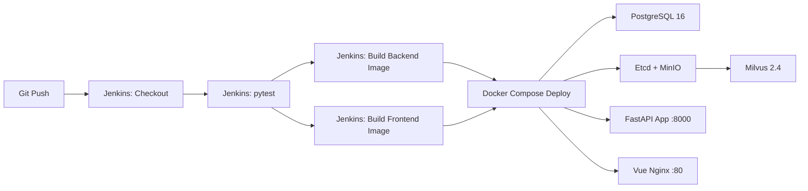
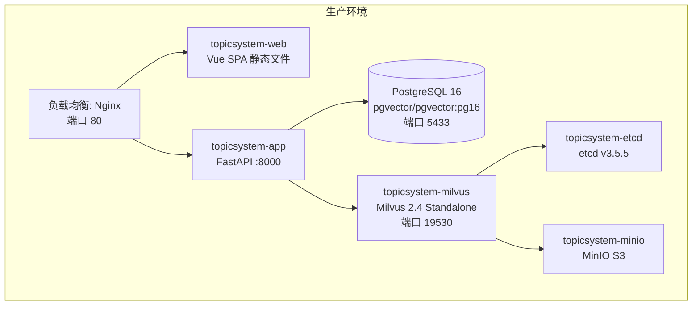

# 部署运维

> **生成时间**：2026-06-12 00:06:53  
> **基于提交**：168f526（main）  
> **覆盖模块**：全部

---

## 部署架构



## CI/CD 流水线

| 工具 | 配置文件 | 触发条件 |
|------|----------|----------|
| Jenkins | `Jenkinsfile` | Git Push（推测） |

### Jenkinsfile 阶段

| 阶段 | 操作 |
|------|------|
| **Checkout** | `checkout scm` |
| **Test** | `pip install pytest pytest-asyncio httpx` + `pytest tests/test_agentv3.py -q -k "not GoldenDataset"`（Golden Dataset 跳过，失败被 `|| true` 允许） |
| **Build Backend** | `docker build -t topicsystem-app:latest .` |
| **Build Frontend** | `docker build -t topicsystem-web:latest -f TOPICSYSTEM_Web/Dockerfile TOPICSYSTEM_Web/` |
| **Deploy** | `docker compose down app web` + `docker compose up -d`（仅重启 app 和 web 服务，不重启 PG/Milvus） |

## 部署环境

| 环境 | 用途 | 部署策略 |
|------|------|----------|
| 本地开发 | `docker compose up -d` 或直接 `uvicorn` | 手动 |
| CI/测试 | Jenkins Pipeline 自动化 | 自动（Git Push 触发） |
| 生产 | [待补充] | [待补充] |

## 容器化

| 组件 | 基础镜像 | 暴露端口 | 依赖 |
|------|----------|----------|------|
| **app** (FastAPI) | `python:3.12-slim` | 8000 | postgres, milvus |
| **web** (Vue+Nginx) | [待补充]（Nginx 基础镜像） | 80 | app |
| **postgres** | `pgvector/pgvector:pg16` | 5432:5433 | — |
| **etcd** | `quay.io/coreos/etcd:v3.5.5` | — | — |
| **minio** | `minio/minio:RELEASE.2023-03-20T20-16-18Z` | 9001 (Console) | — |
| **milvus** | `milvusdb/milvus:v2.4.0` | 19530, 9091 | etcd, minio |

### 后端 Dockerfile

```dockerfile
FROM python:3.12-slim
RUN pip install -i https://pypi.tuna.tsinghua.edu.cn/simple --no-cache-dir -r requirements.txt
COPY src/ /app/src/
COPY aerich.ini migrations/ scripts/deploy.sh /app/
EXPOSE 8000
CMD ["sh", "-c", "aerich upgrade && uvicorn src.main:app --host 0.0.0.0 --port 8000"]
```

### 健康检查机制

| 服务 | 检查命令 | 间隔 | 重试 |
|------|----------|------|------|
| postgres | `pg_isready -U postgres` | 5s | 5 次 |
| etcd | `etcdctl endpoint health` | 10s | 5 次 |
| minio | `curl -f http://localhost:9000/minio/health/live` | 10s | 5 次 |
| milvus | `curl -f http://localhost:9091/healthz` | 10s | 10 次 |
| app | —（未配置 healthcheck） | — | — |
| web | —（未配置 healthcheck） | — | — |

## 部署流水线图



## 常见运维操作

| 操作 | 命令 |
|------|------|
| 启动全部服务 | `docker compose up -d` |
| 停止全部服务 | `docker compose down` |
| 仅重启后端 | `docker compose restart app` |
| 仅重启前端 | `docker compose restart web` |
| 查看后端日志 | `docker compose logs -f app` |
| 健康检查 | `curl http://localhost:8000/ping` |
| 进入应用容器 | `docker exec -it topicsystem-app bash` |
| 查看数据库 | `docker exec -it topicsystem-pg psql -U postgres -d topic` |
| 数据库迁移 | `docker exec topicsystem-app aerich upgrade` |
| 构建后端镜像 | `docker build -t topicsystem-app:latest .` |
| 构建前端镜像 | `docker build -t topicsystem-web:latest -f TOPICSYSTEM_Web/Dockerfile TOPICSYSTEM_Web/` |
| 查看容器状态 | `docker compose ps` |
| 查看资源使用 | `docker stats` |

## 监控与告警

| 工具 | 用途 | 状态 |
|------|------|------|
| LangFuse | LLM 调用链路追踪（Token 使用、延迟、错误率） | 可选（需配置环境变量） |
| OpenTelemetry | 分布式追踪（Span/Trace 管理） | 预留未实现 |
| Jenkins | CI/CD 构建状态 | 已配置 |

## 持久化卷

| 卷名 | 用途 | Docker Compose 配置 |
|------|------|---------------------|
| `pg_data` | PostgreSQL 数据文件 | `pg_data:/var/lib/postgresql/data` |
| `etcd_data` | Etcd 元数据 | `etcd_data:/etcd` |
| `minio_data` | Milvus 对象存储 | `minio_data:/minio_data` |
| `milvus_data` | Milvus 向量数据 | `milvus_data:/var/lib/milvus` |
