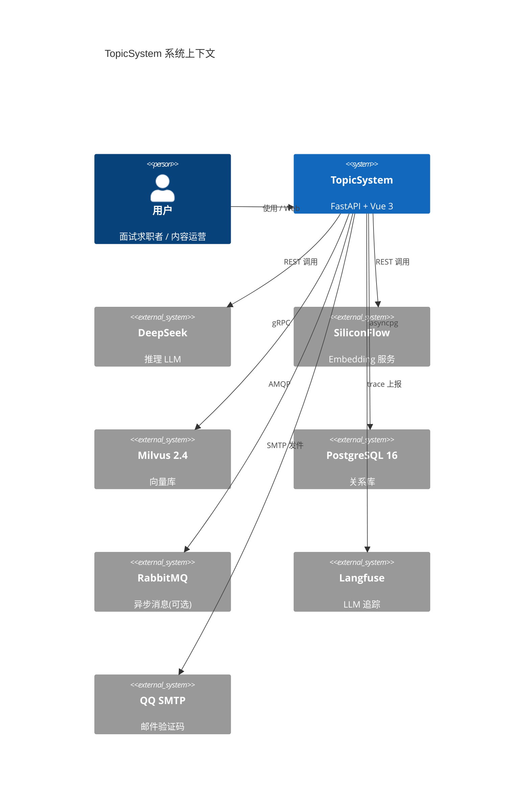

# 架构设计

> **生成时间**：2026-06-18 15:04:06
> **基于提交**:`7648ad3`(main)
> **覆盖模块**：全局

---

## 架构风格

**模块化分层单体**(Modular Monolith)+ **基于 Capability Registry 的 Agent 编排** + **AOP 切面统一非业务关注点**

```
┌────────────────────── HTTP 层 (FastAPI Router) ────────────────────────┐
│  topic_api / interview_api / auth_api / menu_api / healthcheck         │
├────────────────────── Middleware 层 ───────────────────────────────────┤
│  AuthMiddleware (JWT)  →  QuotaMiddleware (配额扣减)                   │
├────────────────────── Capability Registry (AOP 中枢) ──────────────────┤
│  CapabilityRegistry.execute(name, ...) — 切入超时/熔断/日志/耗时       │
│  ▲ 16 个 capability 在此注册:normalize / search / verify / generate / │
│    write / score_answer / extract_context / generate_followup / ...    │
├────────────────────── Agent 层 ────────────────────────────────────────┤
│  Master(出题主控,调度 capability) + Slave(写入子系统)                 │
│  Interview/Session(面试 Loop) + Interview/Router(评分→路由)           │
├────────────────────── 数据访问 ───────────────────────────────────────┤
│  Tortoise ORM (PG)  +  pymilvus (Milvus)  +  outbox 表(补偿)         │
├────────────────────── 基础设施 ───────────────────────────────────────┤
│  pydantic-settings  /  Langfuse 追踪  /  ContextVar 上下文(trace_id)  │
└─────────────────────────────────────────────────────────────────────────┘
```

## 系统上下文图



## 分层设计

| 层级 | 职责 | 关键组件 |
|---|---|---|
| **Router (API)** | HTTP 端点定义 + 入参 Pydantic 校验 | `src/api/{topic,interview,menu,healthcheck}_api.py` + `src/auth/api.py` |
| **Middleware** | 横切关注点(鉴权/配额) | `src/middleware/{auth,quota}.py` |
| **Agent 编排** | 业务流程(出题/面试) | `agentv3/master.py` + `agentv3/interview/{session,router,persona}.py` |
| **Capability** | 原子能力(LLM 调用/DB 查询/向量搜索) | `agentv3/capabilities/*.py` (17 个) + `agentv3/capabilities/register.py` |
| **Registry (AOP)** | 切面入口:超时/熔断/日志/耗时/权限 | `agentv3/registry.py` + `agentv3/circuit_breaker.py` + `agentv3/permissions.py` |
| **Data Access** | ORM + 向量驱动 + 补偿 | `models/*.py` (30 张表) + `tools/{milvus_client,llm_client,embedding}.py` + `models/outbox.py` |
| **Infra** | 配置/日志/追踪/上下文传播 | `config/{settings,database,llm_config}.py` + `tracing/` + `utils/context.py` (ContextVar) |

## 设计模式

| 模式 | 应用 | 位置 |
|---|---|---|
| **Registry / Service Locator** | 16 个 capability 注册到 `CapabilityRegistry`,按名调用 | `agentv3/registry.py` + `capabilities/register.py:103-310` |
| **AOP / Decorator** | `Registry.execute()` 包裹 capability,自动加超时/熔断/log | `agentv3/registry.py:execute()` |
| **Strategy** | InterviewRouter 的评分→路由策略(derivative/extension/prerequisite/summary) | `agentv3/interview/router.py:14-39` |
| **Persona / Template Method** | 面试官风格(Java严师 / 系统架构师 / 算法面试官) | `agentv3/interview/persona.py` + `models/interview_persona.py` |
| **Outbox Pattern** | 写库失败 → 入 `outbox` 表 → worker 补偿 | `models/outbox.py` + `workers/outbox_worker.py` |
| **Circuit Breaker** | LLM/向量库调用熔断 | `agentv3/circuit_breaker.py` |
| **依赖注入** | `Depends(get_current_user)` / Tortoise lifespan | `src/auth/deps.py` + `src/main.py` |
| **Permission Capability** | 每 capability 声明 `Permission.{READ,WRITE,LLM_INVOKE,DB_QUERY,DB_WRITE,DB_MILVUS}` | `agentv3/permissions.py` |

## 架构决策记录(已经实施的 ADR)

| 决策 | 背景 | 结论 | 实施位置 |
|---|---|---|---|
| **ADR-001 用 Capability Registry 而非 LangGraph 节点** | LangGraph 状态机调试困难,组合性差 | 自研 Registry,函数即能力,统一切面 | `agentv3/registry.py`(替换原 `src/agent/graph.py`,后者已废弃) |
| **ADR-002 Master/Slave 分离** | 写库与生成耦合时,失败率影响生成成功率 | Master 只编排,Slave 专责双写 | `agentv3/master.py` + `agentv3/slave.py` + `slave_registry.py` |
| **ADR-003 中间件层化** | 早期 main.py 142 行夹杂鉴权/配额 | 拆 `middleware/auth.py`+`middleware/quota.py`,main.py 缩到 67 行 | `src/middleware/`(本次重构产物) |
| **ADR-004 LLM 配置归一** | 多处独立调 `os.getenv()` 读 API_KEY | `config/llm_config.py` 单源 + `LLMClient` 统一 | `src/config/llm_config.py` |
| **ADR-005 测试库独立** | 测试与生产共库,误删数据风险 | `topic_test` 独立库 + `assert "test" in URL` 防呆 | `tests/conftest.py:14-37` |
| **ADR-006 Outbox 补偿模式** | LLM/邮件/MQ 失败导致请求超时 | 写库前先写 outbox,失败由 worker 重试 | `models/outbox.py` + `workers/outbox_worker.py` |
| **ADR-007 ContextVar 传 trace_id** | 函数参数到处传 trace_id 污染签名 | `current_trace_id`/`current_caller`/`current_budget` 用 ContextVar | `src/utils/context.py` |

## 技术债务与改进建议

| 问题 | 严重度 | 备注 |
|---|---|---|
| `src/agent/`(LangGraph 旧实现)+ `src/agent/nodes/*.py` 已被 v3 替换但未删 | 中 | 占 ~7 个文件,易误读 |
| `src/api/topic_api_v2.py`(服务器存在,本地缺失) | 低 | 本地 100 vs 服务器 117 个 .py,差异详见 [diff 报告](../diff-local-vs-server.md) |
| 16 个 capability 中 `tier` / `owner` 字段未填(register.py 用 None) | 低 | AOP 切面可用,但成本分级失效 |
| 9 个 topic_* 子表测试 xfail 暂挂(schema 已迁 FK,测试用老 content) | 中 | 见 [10-testing.md](10-testing.md) "已知 xfail" |
| `outbox_worker.py` 在 docker-compose 里**未单独起 service**,本地未跑 | 中 | 见 [15-deployment.md](15-deployment.md) |
